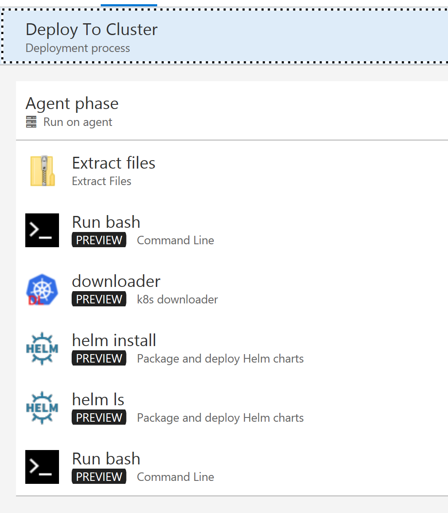

# Model Pipeline Release

*Please read [the first section](readme.md) of this article before continuing here.*

The build is working. It's:

- Building the training and scoring docker images
- Pushing those images to a container registry
- Replace values in the Helm Chart (using Yaml Writer VSTS task)
    - Chart values include target paths, image versions and anything else needed to stand up the environment
    - External values, such as DB connections etc. should still be stored in configmaps or similar (especially keys + KeyVault!)
- Tar the chart and save it as a build artefact. 
    
We've also tested the Helm Chart on the cluster manually to make sure it's working!

## Release Phases

The release will be in two phases. The first phase will deploy to the cluster. This deployment will be standalone - it will not replace other deployments in the cluster.

The second phase will update the cluster routing to point to the new scoring endpoint. This way any deployment in the cluster can be promoted to be the main/production endpoint. Or canary, or what ever else.  

Now the release needs to push the chart to the cluster. This process involves:

- Grab the build artefact
- Install Helm
- Configure the cluster config and authentication
- Install the Helm Chart

### Release Helm Chart to Cluster

Add a new release, and set the artifact to source from the containers build. For now don't turn on CI/CD bits.

Edit the release phases. 

Add an `Extract Files` task. 

- Set "Archive file patterns" to `*.tar.gz`
- Set "Destination folder" to `$(System.DefaultWorkingDirectory)/helm`

Add a `downloader` task. 

- Set your Kubernetes (k8s) service endpoint. See [this](https://docs.microsoft.com/en-us/vsts/build-release/concepts/library/service-endpoints?view=vsts#sep-kuber) for more information. 
- Enable `istioctl` and `helm`. Make sure to set your Helm version to the same version that you have installed in the cluster (tiller needs to match if below version 3 of Helm.)
    - Type `helm version` to check this

Add a `helm install` task. 

- Set the "Connection Type" to `Kubernetes Service Connection` and select the service end point you created from the drop down. 
- Set "Command" to `install` and "Chart Type" to `File Path`. 
- Set "Chart Path" to `$(System.DefaultWorkingDirectory)/helm`.
- Set "Release Name" to `mlrelease-$(Build.BuildNumber)`.
- Set "Value File" to `$(System.DefaultWorkingDirectory)/helm/values.yaml`. 
- Set "Arguments" to `--debug` to help see what's going on. 

Add another helm task

- Set the connection the same as before
- Set the "Command" to `ls` to check the deployment has worked during release task debugging. 

### Test the Release

Only thing left is to run the release on the cluster!

Keep in mind that if you re-run a release from VSTS it will fail becasue the Helm Chart release was already deployed. To clean up run `helm delete <release> --purge`.

### Wait for the Job to Complete

Remember, the job will take a little while to complete and that the service endpoint will not come up until the job has completed. 

Check the job progress by monitoring the job pods have exited by using `kubectl get pods`. 

### Navigate to the Service

The Helm Chart deploys the service endpoint as well as a Kubernetes Service. Type `kubectl get svc` to find the service endpoint.

Find the public IP and navigate to that endpoint!

If you're in Minikube, type `minikube service <servicename>` to navigate to the service. 

Hopefully you see your running service end point!

